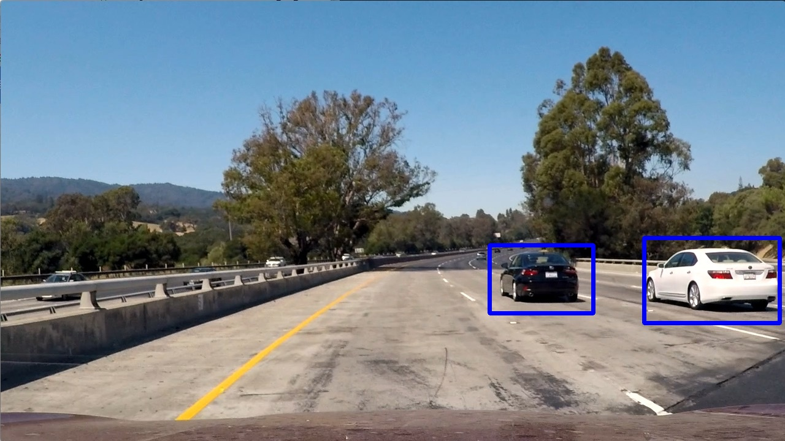

# Vehicle Detection

Detects vehicles in images and videos taken from a car's perspective using an [SVM](https://en.wikipedia.org/wiki/Support_vector_machine) classifier.

## Environment Setup

* Python 3
* NumPy 1.15.2
* SciPy 1.1.0
* scikit-learn 0.20.0
* scikit-image 0.14.0
* OpenCV 3.4.1
* Matplotlib 2.2.2
* MoviePy 0.2.3.5

1. Clone this repo
2. ```~$ conda env create -f environment.yml```  
3. ```~$ source activate vehicle_detection```

## Usage

Run on test images and videos in examples/ of this repo

Image example:


```~$ python detection.py examples/test1.jpg```

Output:

